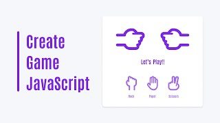

## Welcome to my game development repository! 🎮

Here, you'll find a collection of games I've created with love and passion. From classic retro-style arcade games to modern indie adventures, this repository showcases my journey as a game developer.

What You'll Find:

- Diverse Range of Games → Explore a variety of games, each with its unique gameplay mechanics and challenges.
- Open Source → Dive into the source code of each game to learn how they were built. Feel free to fork, modify, and contribute!
- Interactive Experience → Have fun playing these games directly in your browser or download them to enjoy offline.
- Continuous Updates → Stay tuned for regular updates as I continue to develop new games and enhance existing ones.

 

| Game               | Screenshot                                | Play                                                     | Code                          |
| ------------------ | ----------------------------------------- | -------------------------------------------------------- | ----------------------------- |
| Hangman            |         | [Live](https://hangman-game-jrpranav.onrender.com/)      | [Repo](./Hangman/)            |
| Word Scramble      |    | [Live](https://word-scramble-jrpranav.onrender.com/)     | [Repo](./Word-Scramble/)      |
| Word Guessing      |       | [Live](https://word-guessing-jrpranav.onrender.com/)     | [Repo](./Word-Guessing/)      |
| Color The Parrot   |  | [Live](https://color-the-parrot-jrpranav.onrender.com/)  | [Repo](./Color-The-Parrot/)   |
| Fruit Fall         |       | [Live](https://fruit-fall-jrpranav.onrender.com/)        | [Repo](./Fruit-Fall/)         |
| Memory Match v1    |              | [Live](https://memory-match-v1-jrpranav.onrender.com/)   | [Repo](./Memory-Match-v1/)    |
| Memory Match v2    |              | [Live](https://memory-match-v2-jrpranav.onrender.com/)   | [Repo](./Memory-Match-v2/)    |
| Rock Paper Scissor |             | [Live](https://rock-paper-scissor-jrpranav.onrender.com) | [Repo](./Rock-Paper-Scissor/) |
| Pig Dice           |        | [Live](https://pig-dice-jrpranav.onrender.com)           | [Repo](./Pig-Dice/)           |
| Number Nest        |      | [Live](https://number-nest-jrpranav.onrender.com)        | [Repo](./Number-Nest/)        |
| Tic Tac Toe        |       | [Live](https://tic-tac-toe-jrpranav.onrender.com)        | [Repo](./Tic-Tac-Toe/)        |

 

> [!TIP]
> Drop a 🌟 If you like it.  
> Let's Connect ➡️ Follow me on `GitHub` to stay updated with my latest projects and join me on this exciting journey through the world of game development!
